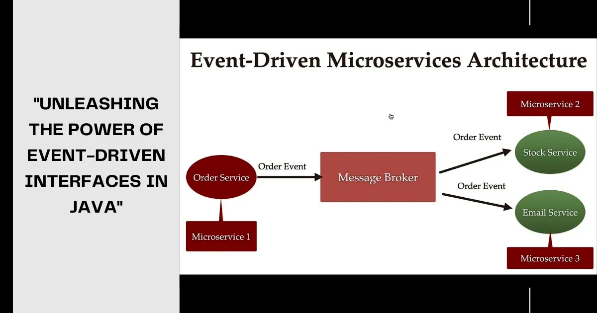

# Event-Driven Interfaces

## Different to Apis.

### How Event-Driven Architecture is that a message is sent after an event has happened. With an event, there is usually no instruction. 

### Events are immutable.

### In order to get serves to respond to these events, this is done through an Event Broker.

### Services subscribe to Even Broker.

### Referred to Pub Sub.

### When services subscribe, they specify which events they want.

## Benefits

### It decouples components as the publisher does not need to know about the services subscribed. No need to call anything in contrast API. If a service goes down, then it does not affect any other services in contrast apis.

## Disadvantages

### There is a delay between when an event is published and when a subscribed gets it.
### Not good for ecommerce website such as keeping track of stock or order history. 

## Java User

### In Java, implementing event-driven interfaces involves defining interfaces that represent events and event handlers. Components can then listen for specific events and respond accordingly. This approach allows for greater flexibility, as components can be added or removed without disrupting the overall system functionality.